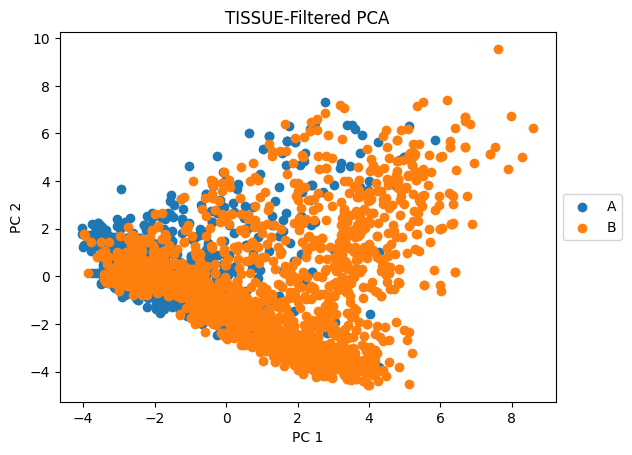

# TISSUE
**TISSUE (Transcript Imputation with Spatial Single-cell Uncertainty Estimation)** provides tools for estimating well-calibrated uncertainty measures for gene expression predictions in single-cell spatial transcriptomics datasets and utilizing them in downstream analyses


## Installation and setup

Complete installation (including of dependencies) of TISSUE in a new Conda environment should take less than 5 minutes on a normal desktop/laptop setup (Windows, Mac OSX, Linux). The base version of TISSUE requires SquidPy and all of its dependencies. The base version comes with the SpaGE spatial gene expression prediction method. Additional TISSUE functionalities (i.e. Tangram prediction, Harmony-kNN prediction, gimVI prediction, TISSUE-WPCA, TISSUE multiple imputation with SpatialDE) require installing additional dependencies, which are listed in `requirements.txt`. These should be installed with `pip install <package name>==<package version>` inside the same Conda environment as TISSUE (preferably before TISSUE installation).

For TISSUE installation, we provide two options: (A) PyPI installation with pip or (B) local installation. We recommend starting with option A and only going to option B if option A fails in your environment.

### Option A: PyPI

Install the package through PyPI with `pip`. We recommend setting up a conda environment (https://docs.conda.io/projects/conda/en/latest/user-guide/tasks/manage-environments.html) or another virtual environment first since `tissue-sc` currently relies on specific versions for its dependencies (although it should generally work for other environment versions, but this hasn't been thoroughly tested):

```
conda create -n myenv python=3.8
conda activate myenv

<pip install any additional dependencies>
pip install tissue-sc
```

Note that you will want to separately download the data from this repository (`tests/data/`) to run our TISSUE tutorials.


### Option B: Local installation

An alternative way to install the package along with associated test and tutorial files is to clone the directory and then install the requirements for using the package. To do this, first clone the repository using git (you can install git following the instructions [here](https://github.com/git-guides/install-git)):

```
git clone https://github.com/sunericd/TISSUE.git
```

We recommend setting up a conda environment to install the requirements for the package (instructions for installing conda and what conda environment can do can be found [here](https://docs.conda.io/projects/conda/en/latest/user-guide/install/index.html)). Installation of requirements can then be done with the following commands:

```
conda create -n tissue python=3.8
conda activate tissue

cd TISSUE
pip install -r requirements.txt
```

To keep the requirements light, we have only included packages that are necessary for the core functionalities of TISSUE. For additional utilities such as gene prediction with Tangram, please install those packages separately (or uncomment those lines in `requirements.txt`).

To test that the installation is working correctly, you can run `python test.py` in the cloned directory.


# TISSUE Tutorials

Below we include several mini-tutorials to highlight the main TISSUE pipeline and downstream applications. These tutorials rely on a small test dataset (a subset of one of the datasets used in the original publication) for fast processing but the approaches can readily be extended to other datasets. For larger-scale examples, please refer to the code repository corresponding the figures and analyses generated for the TISSUE manuscript: https://github.com/sunericd/tissue-figures-and-analyses.git


```python
# import packages

import tissue.main, tissue.downstream

import numpy as np
import pandas as pd
import matplotlib.pyplot as plt
import scanpy as sc
import anndata as ad
import os
```

## Upstream TISSUE analyses: spatial gene expression prediction and uncertainty calibration

The first part of the TISSUE pipeline involves making predictions of spatial gene expression profiles using paired spatial transcriptomics and scRNAseq datasets, and then computing and calibrating uncertainties for these predictions that are translated to prediction intervals. All functions for upstream analysis are in the `tissue.main` module. These include:

- `tissue.main.load_paired_datasets()` for loading paired datasets from formatted directories

- `tissue.main.predict_gene_expression()` for predicting spatial gene expression from paired datasets using a specified prediction method and number of cross-validation folds

- `tissue.main.build_spatial_graph()` for building a cell-cell spatial graph to define neighborhoods for computing the cell-centric variability

- `tissue.main.conformalize_spatial_uncertainty()` for computing cell-centric variability, stratified grouping, and the TISSUE calibration scores for predicted gene expression

- `tissue.main.conformalize_prediction_interval()` for building prediction intervals from uncertainty measures

### Tutorial 1: Predicting spatial gene expression

First, we load a minimal subset of osmFISH spatial transcriptomics data of mouse somatosensory cortex published by Codeluppi et al., 2018: https://doi.org/10.1038/s41592-018-0175-z. 

Note that we are using the TISSUE methods for building an AnnData object from tab-delimited text files for the spatial counts, scRNAseq counts, spatial locations, and spatial metadata. If you already have an AnnData object for the spatial data and another object for the scRNAseq data, you can skip this step.


```python
# load in spatial and scRNAseq datasets

adata, RNAseq_adata = tissue.main.load_paired_datasets("tests/data/Spatial_count.txt",
                                                       "tests/data/Locations.txt",
                                                       "tests/data/scRNA_count.txt")
```

    /home/edsun/anaconda3/envs/tissue/lib/python3.8/site-packages/anndata/_core/anndata.py:117: ImplicitModificationWarning: Transforming to str index.
      warnings.warn("Transforming to str index.", ImplicitModificationWarning)
    /home/edsun/anaconda3/envs/tissue/lib/python3.8/site-packages/anndata/_core/anndata.py:856: UserWarning: 
    AnnData expects .obs.index to contain strings, but got values like:
        [0, 1, 2, 3, 4]
    
        Inferred to be: integer
    
      names = self._prep_dim_index(names, "obs")


Now we can impute any genes of interest that are found in the scRNAseq dataset but not in the spatial dataset. In this case, we will hold out a target gene from the spatial data and apply an imputation method to predict its expression using the scRNAseq dataset.

First, we preprocess the data and make sure that the gene names are matchable across the two datasets:


```python
# make genes lowercase
adata.var_names = [x.lower() for x in adata.var_names]
RNAseq_adata.var_names = [x.lower() for x in RNAseq_adata.var_names]

# preprocess RNAseq data
tissue.main.preprocess_data(RNAseq_adata, standardize=False, normalize=True)

# subset spatial data into shared genes
gene_names = np.intersect1d(adata.var_names, RNAseq_adata.var_names)
adata = adata[:, gene_names].copy()

# hold out target gene
target_gene = "plp1"
target_expn = adata[:, target_gene].X.copy()
adata = adata[:, [gene for gene in gene_names if gene != target_gene]].copy()
```


```python
# dimensions of spatial transcriptomics dataset (number of cells x number of genes)
adata.shape
```


    (3405, 31)


```python
# dimensions of RNAseq dataset (number of cells x number of genes)
RNAseq_adata.shape
```


    (1000, 32)


Now, we can make predictions of the target gene expression. In TISSUE, we currently have several methods for gene imputation including SpaGE, Tangram, and Harmony-kNN. We will be using SpaGE in this example:


```python
# SpaGE spatial gene expression prediction

tissue.main.predict_gene_expression (adata, RNAseq_adata, [target_gene],
                                     method="spage", n_folds=10, n_pv=10)
```

How good is the imputation? Since we left out this gene from the spatial data, we can plot the predicted and actual expression and visually inspect the agreement.


```python
# Visualizing predicted and actual expression side by side

fig, (ax1, ax2) = plt.subplots(1, 2)

ax1.axis('off')
cmap = target_expn
cmap[cmap<0] = 0
cmap = np.log1p(cmap)
cmap[cmap > np.percentile(cmap,95)] = np.percentile(cmap,95)
im = ax1.scatter(adata.obsm['spatial'][:,0],adata.obsm['spatial'][:,1],s=1,c=cmap,rasterized=True)
ax1.set_title('Actual', fontsize = 12)

cbar = fig.colorbar(im)
cbar.ax.get_yaxis().labelpad = 15
cbar.ax.set_ylabel('Log Expression', rotation=270)

ax2.axis('off')
cmap = adata.obsm['spage_predicted_expression'][target_gene].values
cmap[cmap<0] = 0
cmap = np.log1p(cmap)
cmap[cmap > np.percentile(cmap,95)] = np.percentile(cmap,95)
im = ax2.scatter(adata.obsm['spatial'][:,0],adata.obsm['spatial'][:,1],s=1,c=cmap,rasterized=True)
ax2.set_title('Predicted', fontsize = 12)

cbar = fig.colorbar(im)
cbar.ax.get_yaxis().labelpad = 15
cbar.ax.set_ylabel('Log Expression', rotation=270)

plt.suptitle("SpaGE Prediction", fontsize=16)
plt.tight_layout()
plt.show()
```


    

    


Not too bad, especially considering that we used a downsampled scRNAseq dataset for this imputation.

### Tutorial 2: Using TISSUE to calibrate uncertainties and obtain prediction intervals

Note that when we ran `tissue.main.predict_gene_expression()` in the previous tutorial, we obtained cross-validated predictions for all genes in the existing spatial dataset (e.g. 10 folds). These will now come in handy when we compute and calibrate TISSUE uncertainties for the predicted gene expression.

First, we build spatial graphs using TISSUE (this can also be done with native Scanpy functions):


```python
# build spatial graph and calculate adjacency weights

tissue.main.build_spatial_graph(adata, method="fixed_radius", n_neighbors=15)
```

The entire TISSUE spatial uncertainty generation pipeline can be launched with one line of code using `tissue.main.conformalize_spatial_uncertainty()`. Here, the first two arguments are the spatial AnnData object and a string specifier for the key in `obsm` corresponding to the predicted gene expression. We can specify which of the genes to use in the calibration set (generally this is all genes in the spatial data). There are other arguments for the grouping setup and weighting schemes, but we will use the default settings in this tutorial.


```python
# build calibration scores

tissue.main.conformalize_spatial_uncertainty(adata, "spage_predicted_expression", calib_genes=adata.var_names,
                                             grouping_method="kmeans_gene_cell", k=4, k2=2)
```

    /home/edsun/anaconda3/envs/tissue/lib/python3.8/site-packages/sklearn/cluster/_kmeans.py:870: FutureWarning: The default value of `n_init` will change from 10 to 'auto' in 1.4. Set the value of `n_init` explicitly to suppress the warning
      warnings.warn(
    /home/edsun/anaconda3/envs/tissue/lib/python3.8/site-packages/sklearn/cluster/_kmeans.py:870: FutureWarning: The default value of `n_init` will change from 10 to 'auto' in 1.4. Set the value of `n_init` explicitly to suppress the warning
      warnings.warn(
    /home/edsun/anaconda3/envs/tissue/lib/python3.8/site-packages/sklearn/cluster/_kmeans.py:870: FutureWarning: The default value of `n_init` will change from 10 to 'auto' in 1.4. Set the value of `n_init` explicitly to suppress the warning
      warnings.warn(
    /home/edsun/anaconda3/envs/tissue/lib/python3.8/site-packages/sklearn/cluster/_kmeans.py:870: FutureWarning: The default value of `n_init` will change from 10 to 'auto' in 1.4. Set the value of `n_init` explicitly to suppress the warning
      warnings.warn(
    /home/edsun/anaconda3/envs/tissue/lib/python3.8/site-packages/sklearn/cluster/_kmeans.py:870: FutureWarning: The default value of `n_init` will change from 10 to 'auto' in 1.4. Set the value of `n_init` explicitly to suppress the warning
      warnings.warn(


Finally, we can calibrate the spatial uncertainty measures to get calibration scores and then use those to extract prediction intervals for any confidence level $1-\alpha$. This is done with `tissue.main.conformalize_prediction_interval()`


```python
# get prediction interval for 67% coverage

tissue.main.conformalize_prediction_interval (adata, "spage_predicted_expression", calib_genes=adata.var_names,
                                              alpha_level=0.23, compute_wasserstein=True)
```


```python
adata
```


    AnnData object with n_obs × n_vars = 3405 × 31
        uns: 'conf_genes_used', 'target_genes_used', 'spatial_neighbors', 'spage_predicted_expression_kg', 'spage_predicted_expression_kc', 'alpha'
        obsm: 'spatial', 'spage_predicted_expression', 'spage_predicted_expression_uncertainty', 'spage_predicted_expression_score', 'spage_predicted_expression_error', 'spage_predicted_expression_groups', 'spage_predicted_expression_lo', 'spage_predicted_expression_hi', 'spage_predicted_expression_wasserstein'
        obsp: 'spatial_connectivities', 'spatial_distances'


Here we turned on the Wasserstein distance metric, which returns a measure indicating the distance between the cell-centric variability values of the predicted genes and the values of their support (i.e. calibration group) in the original data. The lower this value, the better supported the predicted group.

Now let's visualize what these prediction intervals look like for the target (unseen) gene and how it compares to the actual prediction errors.


```python
m = "spage"

i = np.where(adata.var_names == target_gene)[0]

# define consistent color map
all_vals = np.concatenate((np.abs(target_expn.flatten()-adata.obsm[m+"_predicted_expression"][target_gene].values),
                           adata.obsm[m+f"_predicted_expression_hi"][target_gene].values-adata.obsm[m+f"_predicted_expression_lo"][target_gene].values))
all_vals[all_vals<0]=0
vmin = np.percentile(np.log1p(all_vals), 0)
vmax = np.percentile(np.log1p(all_vals), 95)


fig, (ax1, ax2) = plt.subplots(1, 2)

ax1.axis('off')
cmap = np.abs(target_expn.flatten()-adata.obsm[m+"_predicted_expression"][target_gene].values)
cmap[cmap<0] = 0
cmap = np.log1p(cmap)
cmap[cmap > np.percentile(cmap,95)] = np.percentile(cmap,95)
im = ax1.scatter(adata.obsm['spatial'][:,0],adata.obsm['spatial'][:,1],s=1,c=cmap,rasterized=True)#,vmin=vmin,vmax=vmax)
ax1.set_title('Imputation Error ' + target_gene, fontsize = 12)

cbar = fig.colorbar(im)
cbar.ax.get_yaxis().labelpad = 15
cbar.ax.set_ylabel('Log Expression', rotation=270)

ax2.axis('off')
cmap = adata.obsm[m+f"_predicted_expression_hi"][target_gene].values-adata.obsm[m+f"_predicted_expression_lo"][target_gene].values
cmap[cmap<0] = 0
cmap = np.log1p(cmap)
cmap[cmap > np.percentile(cmap,95)] = np.percentile(cmap,95)
im = ax2.scatter(adata.obsm['spatial'][:,0],adata.obsm['spatial'][:,1],s=1,c=cmap,rasterized=True)#,vmin=vmin,vmax=vmax)
ax2.set_title('PI Width ' + target_gene, fontsize = 12)

cbar = fig.colorbar(im)
cbar.ax.get_yaxis().labelpad = 15
cbar.ax.set_ylabel('Log Expression', rotation=270)

plt.suptitle(m, fontsize=16)
plt.tight_layout()
plt.show()
```


    

    


The TISSUE prediction intervals are decent and match the distribution of imputation errors especially well in the bottom portions of the section. On the full dataset, which has much richer reference scRNAseq data, the calibration quality is further improved (see Figure 2 of the TISSUE manuscript).

## Downstream TISSUE analyses: Hypothesis testing, Clustering/Visualization, Prediction

TISSUE provides additional functionalities for leveraging these uncertainty estimates and prediction intervals in common downstream single-cell spatial transcriptomics analysese. All functions for downstream analysis are in the `tissue.downstream` module. These include:

- `tissue.downstream.multiple_imputation_testing()` for hypothesis testing using multiple imputations drawn from the calibration score sets

- `tissue.downstream.weighted_PCA()` for computing weighted principal components where weights correspond to a transform of the inverse prediction interval width

- `tissue.downstream.detect_uncertain_cells()` for filtering low-confidence cells from data before training and evaluation of machine learning models, which generally improves performance

Below we include a few example uses of these modules. For more examples (including those for the experiments in the associated manuscript), please see the Github repository: https://github.com/sunericd/tissue-figures-and-analyses.git.

### Tutorial 3: Hypothesis testing with TISSUE multiple imputation framework

This tutorial uses the TISSUE calibration scores to generate multiple imputations and then perform hypothesis testing by aggregating statistics across these multiple imputations. The default and recommended statistical test for this framework is the Student's t-test, but other options for spatially variable gene detection using SpatialDE and non-parametric (one-sided) Mann-Whitney/Wilcoxon tests can also be performed by specifying `method="spatialde"`, `method="wilcoxon_greater"`, `method="wilcoxon_less"` for `tissue.downstream.multiple_imputation_testing()`.

Please run the code in Tutorials 1-2 to generate predictions and TISSUE uncertainty measures before this tutorial.

After, we construct some binary labels for the cells in the dataset:


```python
# split into two groups based on indices
adata.obs['condition'] = ['A' if i < round(adata.shape[0]/2) else 'B' for i in range(adata.shape[0])]

# plot conditions
sc.pl.embedding(adata, 'spatial', color='condition')
```

    /home/edsun/anaconda3/envs/tissue/lib/python3.8/site-packages/scanpy/plotting/_tools/scatterplots.py:392: UserWarning: No data for colormapping provided via 'c'. Parameters 'cmap' will be ignored
      cax = scatter(


    

    


As we can see, the cells in group A primarily belong to the medial layers of the section while the cells in group B correspond to upper pia layer and also the bottom layers of the section. As such, when we do differential gene expression analysis, we should expect some differentially expressed markers between these two labels.

Now, we perform differential gene expression analysis using TISSUE multiple imputation hypothesis testing, which works by using TISSUE calibration scores to sample multiple "imputations" (alternative predictions) and then aggregate these statistics together afterwards. Here, we set `group1="A"` and `group2="B"` to find genes that differentially expressed between the two groups across `n_imputations=10` number of imputations (higher values here are better but take more time to compute):


```python
# multiple imputation hypothesis testing

tissue.downstream.multiple_imputation_testing(adata, "spage_predicted_expression",
                                              calib_genes=adata.var_names,
                                              condition='condition',
                                              group1 = "A", # use None to compute for all conditions, condition vs all
                                              group2 = "B", # use None to compute for group1 vs all
                                              n_imputations=10)
```

TISSUE multiple imputation testing saves the results directing within the `adata.uns` metadata and can be read out by the compared groups and the name of the statistic:


```python
# extract statistics for target_gene
print("t-statistic = "+str(round(adata.uns['spage_A_B_tstat'][target_gene].values[0],5)))
print("P = "+str(round(adata.uns['spage_A_B_pvalue'][target_gene].values[0],5)))
```

    t-statistic = -2.29955
    P = 0.03283


Testing of our target gene (Plp1) results in significant under-expression in group A as compared to group B, suggesting that Plp1 could be a marker gene for the cell types / regions in group B.

### Tutorial 4: TISSUE cell filtering for supervised learning

TISSUE cell filtering removes cells with the greatest average uncertainty in predicted gene expression, which generally improves the performance of supervised learning models (i.e. classifiers) when trained and evaluated on these filtered predicted expression data.

In this tutorial, we will filter out the uncertain cells (using automatic Otsu thresholding) and then train and evaluate a logistic regression classifier to predict the two cell groups (A vs B) from Tutorial 3.

To start, we will need to compute the TISSUE prediction interval width as a proxy for uncertainty. We do this by subtracting the lower bound from the upper bound:


```python
# get uncertainty (PI width) for filtering

X_uncertainty = adata.obsm["spage_predicted_expression_hi"].values - adata.obsm["spage_predicted_expression_lo"].values
```

Then we can filter using the TISSUE prediction interval width. We perform filtering within each strata (i.e. cell group label "A" or "B"), but this can also be done across other groupings or across the entire population of cells if desired. Here we use Otsu thresholding to automatically determine the proportion of cells to filter out within each strata, but you can set this to a hard threshold if desired.


```python
# uncertainty-based cell filtering

keep_idxs = tissue.downstream.detect_uncertain_cells (X_uncertainty,
                                                      proportion="otsu",
                                                      stratification=adata.obs['condition'].values)

adata_filtered = adata[adata.obs_names[keep_idxs],:].copy()
```

Now that we have an object with filtered predicted gene expression, we can check to see how the dimensions of our data have changed from TISSUE filtering:


```python
# examine dimensions of data before/after TISSUE filtering

print("Before TISSUE cell filtering:")
print(adata.shape)
print("\nAfter TISSUE cell filtering:")
print(adata_filtered.shape)
```

    Before TISSUE cell filtering:
    (3405, 31)
    
    After TISSUE cell filtering:
    (2870, 31)


And similarly, we can check the balance in the two cell groups after filtering:


```python
# print balance of labels in the filtered dataset

pd.DataFrame(np.unique(adata_filtered.obs['condition'], return_counts=True),index=["Group","Number of Cells"])
```


<div>
<style scoped>
    .dataframe tbody tr th:only-of-type {
        vertical-align: middle;
    }

    .dataframe tbody tr th {
        vertical-align: top;
    }

    .dataframe thead th {
        text-align: right;
    }
</style>
<table border="1" class="dataframe">
  <thead>
    <tr style="text-align: right;">
      <th></th>
      <th>0</th>
      <th>1</th>
    </tr>
  </thead>
  <tbody>
    <tr>
      <th>Group</th>
      <td>A</td>
      <td>B</td>
    </tr>
    <tr>
      <th>Number of Cells</th>
      <td>1252</td>
      <td>1618</td>
    </tr>
  </tbody>
</table>
</div>


As we can see, TISSUE automatically filters out a large number of cells with uncertain gene predictions. In the filtered dataset, the balance between group A and group B is relatively preserved.

Now, we will move on to training a logistic regression classifier on the filtered data. Given the modular nature of TISSUE filtering (i.e. the output is a cellxgene matrix), integrating TISSUE with other supervised learning models is as easy as plug-and-play.

First, we split into a train (80%) and test set (20%):


```python
# split train and test randomly (80%-20%)
np.random.seed(444)
train_idxs = np.random.choice(np.arange(adata_filtered.shape[0]), round(adata_filtered.shape[0]*0.8), replace=False)
test_idxs = np.array([idx for idx in np.arange(adata_filtered.shape[0]) if idx not in train_idxs])

train_data = adata_filtered.obsm["spage_predicted_expression"].values[train_idxs,:]
train_labels = adata_filtered.obs["condition"][train_idxs]

test_data = adata_filtered.obsm["spage_predicted_expression"].values[test_idxs,:]
test_labels = adata_filtered.obs["condition"][test_idxs]
```

Then, we train logistic regression classifier on the filtered and split data:


```python
from sklearn.linear_model import LogisticRegression
from sklearn.preprocessing import StandardScaler
from sklearn.metrics import accuracy_score, f1_score, roc_auc_score, average_precision_score

# init and scale data
scaler = StandardScaler()
train_data = scaler.fit_transform(train_data)

# fit model on scaled data
model = LogisticRegression(penalty='l1', solver='liblinear').fit(train_data, train_labels)
```

Now that we have trained the model, we can evaluate its performance on the unseen test data:


```python
# make predictions on test data
pred_test = model.predict(scaler.transform(test_data))
pred_test_scores = model.predict_proba(scaler.transform(test_data))

# print metrics
test_labels_num = [0 if x=="A" else 1 for x in test_labels]
print(f"Accuracy Score: {accuracy_score(test_labels, pred_test)}")
print(f"ROC-AUC Score: {roc_auc_score(test_labels_num, pred_test_scores[:,1])}")
```

    Accuracy Score: 0.7961672473867596
    ROC-AUC Score: 0.8631798138167566


The model performs quite well! It has high accuracy and high ROC-AUC for a relatively balanced binary classification problem. A similar approach can be taken to leverage TISSUE uncertainties in training/evaluating other model architectures (e.g. linear regression, random forest, neural nets).

### Tutorial 5: TISSUE cell filtering for PCA (clustering and visualization)

Downstream clustering and data visualization tasks in transcriptomics data analysis generally rely on dimensionality reduction via principal component analysis (PCA). To incorporate TISSUE uncertainties in these downstream tasks, we perform TISSUE cell filtering before fitting the PCA model and reducing dimensionality.

In this tutorial, we will apply TISSUE cell filtering to the dataset to generate principal components. This can be done with `tissue.downstream.filtered_PCA()` which is wrapper around the direct TISSUE cell filtering. From these principal components, we can make a two-dimensional PCA plot and perform clustering on the top 15 principal components using K-Means.

We will be starting with the AnnData object after running Tutorials 1-3: `adata` and then applying TISSUE-filtered PCA:


```python
# uncertainty-based cell filtering for PCA

keep_idxs = tissue.downstream.filtered_PCA (adata, # anndata object
                                            "spage", # prediction method
                                            proportion="otsu",
                                            stratification=adata.obs['condition'].values,
                                            return_keep_idxs=True)

# filter to keep track of labels
adata_filtered = adata[adata.obs_names[keep_idxs],:].copy()
```

Here we used the same `otsu` threshold-based automatic filtering as before and stratify the filtering by the conditions. We use the default `n_components=15`.

There are two options for the TISSUE-filtered PCA, both of which are saved into `adata.uns` and `adata.obsm` respectively. The first is the standard principal components obtained on the TISSUE-filtered data, which can be found in `adata.uns['{name of prediction method}_predicted_expression_PC15_filtered_']`. The second is the PCA fitted onto TISSUE-filtered data but then applied to the entire dataset (unfiltered), which can be found in `adata.obsm['{name of prediction method}_predicted_expression_PC15_']`. We will use the first (and recommended) option in this tutorial


```python
# retrieve filtered PCA

PC_reduced = adata.uns['spage_predicted_expression_PC15_filtered_'].copy()
print(PC_reduced.shape)
```

    (2870, 15)


We now have a reduced representation of our original data that is filtered by TISSUE and has 15 principal components. We can visualize the first two principal components:


```python
# make 2D PCA plot labeled by group

plt.title("TISSUE-Filtered PCA")
plt.scatter(PC_reduced[adata_filtered.obs['condition']=='A',0],
            PC_reduced[adata_filtered.obs['condition']=='A',1],
            c="tab:blue", label="A")
plt.scatter(PC_reduced[adata_filtered.obs['condition']=='B',0],
            PC_reduced[adata_filtered.obs['condition']=='B',1],
            c="tab:orange", label="B")
plt.legend(loc='center left', bbox_to_anchor=(1, 0.5))
plt.xlabel("PC 1")
plt.ylabel("PC 2")
plt.show()
```


    

    


Visually, there is some separation between the two groups on the first two principal components (although lots of overlap too).

Next, we can try K-Means clustering using all 15 principal components (and evaluate clustering with the ARI):


```python
from sklearn.cluster import KMeans

# K-Means clustering
kmeans = KMeans(n_clusters=2).fit(PC_reduced)
clusters = kmeans.labels_

# evaluate ARI
from sklearn.metrics import adjusted_rand_score
print(adjusted_rand_score(adata_filtered.obs['condition'], clusters))
```

    /home/edsun/anaconda3/envs/tissue/lib/python3.8/site-packages/sklearn/cluster/_kmeans.py:870: FutureWarning: The default value of `n_init` will change from 10 to 'auto' in 1.4. Set the value of `n_init` explicitly to suppress the warning
      warnings.warn(


    0.21763240085325367


Evidently, the clustering with TISSUE-filtered principal components can provide some degree of separation between the two cell groups that we defined previously.

### Tutorial 6: TISSUE-WPCA (weighted principal component analysis)

An alternative approach to TISSUE cell filtering for PCA is TISSUE-WPCA, which involves weighting each value in the predicted gene expression matrix in PCA, thus allowing for a softer approach that can leverage more of the predicted expression data. However, in practice, TISSUE-WPCA generally does not yield as many changes to the resulting principal components than TISSUE cell filtering when compared to normal PCA.

TISSUE-WPCA is highly customizable, mostly in the definition of the weights (see source code for more details and documentation). We use one of the implementations highlighted in the TISSUE manuscript, which involves the inverse TISSUE prediction interval width that is then binarized into a high weight and a low weight that are separated by an order of magnitude:


```python
# weighted PCA

tissue.downstream.weighted_PCA(adata, "spage", pca_method="wpca", weighting="inverse_pi_width",
                               replace_inf="max", binarize=0.2, binarize_ratio=10,
                               n_components=15)
```

Here we used the `inverse_pi_width` method which uses the inverse prediction interval width as the initial weight. We replace all `inf` values with the maximum weights. We specify `binarize=0.2`, which is the proportion of cells to draw the high/low weight split. The `binarize_ratio` is the fold-change between the high and low weight values, and we use `n_components=15`.

Now that we have performed TISSUE-WPCA, we can access the resulting principal components from `adata.obsm['{prediction method name}_predicted_expression_PC15_']` and use these as we would with any other reduced representation of the data. For example, we can visualize the two cell groups along the first two principal components:


```python
# make PC plot

X_pc = adata.obsm['spage_predicted_expression_PC15_']

plt.title("TISSUE Weighted PCA")
plt.scatter(X_pc[adata.obs['condition']=='A',0], X_pc[adata.obs['condition']=='A',1], c="tab:blue", label="A")
plt.scatter(X_pc[adata.obs['condition']=='B',0], X_pc[adata.obs['condition']=='B',1], c="tab:orange", label="B")
plt.xlabel("PC 1")
plt.ylabel("PC 2")
plt.legend(loc='center left', bbox_to_anchor=(1, 0.5))
plt.show()
```


    

    


Similarly to TISSUE cell filtering PCA, we see that TISSUE-WPCA can visually separate the two cell groups in the PCA plot.

# Additional considerations

## Hyperparameter selection:

At various parts of the TISSUE pipeline, the user can select different hyperparameters. Here we outline some guiding principles for reasonably selecting these hyperparameters:

- `n_neighbors` in `tissue.main.build_spatial_graph()` - the approximate number of neighbors to use for computing TISSUE cell-centric variability. Generally, we recommend setting this to a value close to 15 to ensure reliable cell-centric variability estimates. Values from 5-30 also work comparably well. Alternatively, you can try out other spatial graph methods such as the other options in `tissue.main.build_spatial_graph()` or load in your own spatial graph adjacency matrix using `tissue.main.load_spatial_graph()` from a .npz file.

- `alpha_level` in `tissue.main.conformalize_prediction_interval()` - the confidence measure corresponding to (1-alpha) TISSUE prediction interval coverage. Generally, we recommend 0.23 to retrieve the 67% TISSUE prediction interval (approx. one standard error) but downstream results are largely robust to the exact choice. Values very close to 0 or very close to 1 are less likely to provide informative calibrations.

- `k`, `k2` in `tissue.main.conformalize_spatial_uncertainty()` - these are the gene and cell stratified group numbers respectively. You can try different values for each of these, but we recommend staying below 4 for either parameter. In the manuscript, we primarily used `k=4` and `k2=1`. If you don't want to choose, TISSUE can automatically select these hyperparameters if you set `k='auto'` and `k2='auto'`.


## Computational runtime and speed ups:

If you are experiencing slow runtimes with TISSUE, there are several things to check or change for faster runtime (also refer to Extended Data Figure 9 in our publication for runtime breakdown in the first version of TISSUE for different-sized datasets):


**Large number of cells**
- We have tested TISSUE on datasets up to 20K cells. If your data contains substantially more cells, we recommend downsampling the cells (e.g. random uniform sampling) or subsetting to cell groups of interest.
- If the prediction step takes a long time, we suggest decreasing the number of cross-validation folds by setting `n_folds` in `tissue.main.predict_gene_expression()`.

**Large number of genes**
- Generally TISSUE is robust to the number of genes but for further speedup, we recommend only predicting genes that are necessary or using the scRNAseq reference dataset to identify a set of highly variable genes for prediction beforehand (if whole-transcriptome is desired, for example using `scanpy.pp.highly_variable_genes`).
- Set `weight='exp_cos_pca'` and `weight_n_pc` to some integer (e.g. 15) in `tissue.main.conformalize_spatial_uncertainty()` to perform cosine similarity weights based on low-dimensionality (for better runtime and reduce high-dimensional distortions)
- Set `n_pc` and `n_pc2` to some integer (e.g. 15) in `tissue.main.conformalize_spatial_uncertainty()` so that k-means clustering will be done on lower dimensional space (for better runtime and performance)

**Other runtime tips**:

- Turn off Wasserstein calculation in `tissue.main.conformalize_prediction_interval()` by setting `compute_wasserstein=False` (default)


## Memory usage:

We have optimized TISSUE to be memory-efficient with respect the size of the original dataset. Since spatial transcriptomics datasets can be very large, and TISSUE requires additional overhead for some of its operations, here are some suggestions for dealing with memory issues:

- For downsizing datasets with many cells or many genes (to predict), refer to the previous section on runtimes for ways of downsampling for both improved runtime and lower memory usage

- In `tissue.main.build_spatial_graph()`, you can consider setting `radius` to a value (default is None) for any of the radius-based methods. This is more important in older versions of TISSUE, which were not optimized.

- In `tissue.downstream.multiple_imputation_testing()`, make sure that `save_mi=False` which stops saving of each multiple imputation into memory.


# UNDER DEVELOPMENT:
- Multi-threading for making cross-validation predictions in `tissue.main.predict_gene_expression()`.

# Citation

For Jupyter notebooks and Python scripts associated with our original publication, please refer to https://github.com/sunericd/tissue-figures-and-analyses.git. **NOTE: For the original publication, we used TISSUE version 0.0.2**

If you find this code useful, we would appreciate it if you cite the following publications:

**Sun ED, Ma R, Navarro Negredo P, Brunet A, Zou J. TISSUE: uncertainty-calibrated prediction of single-cell spatial transcriptomics improves downstream analyses. Preprint at https://doi.org/10.1101/2023.04.25.538326 (2023).**
